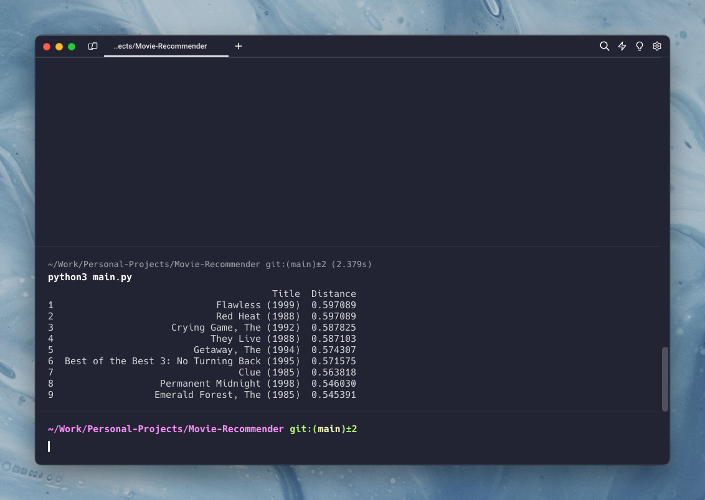
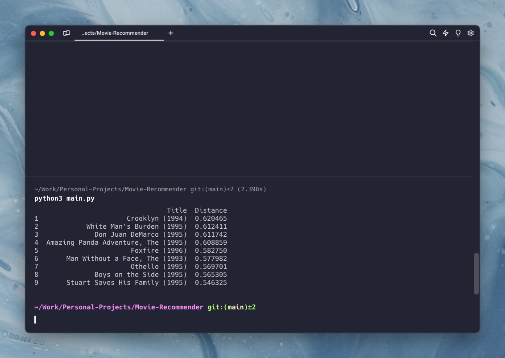

# Movie-Recommendation-System
## Description
The Movie-Recommendation-System is a machine learning project designed to provide personalised movie suggestions to users. It utilises a collaborative filtering approach, leveraging the K-Nearest Neighbors (KNN) algorithm to analyze and predict user preferences based on a dataset of user ratings and movie metadata.

The dataset used for this project is from the GitHub Repository [ml-latest-small](https://github.com/smanihwr/ml-latest-small) by smanihwr.

The project is implemented in Python using the following libraries:
- Pandas
- Numpy
- Scikit-learn
- Fuzzywuzzy

## Context

This project serves as an extension to a presentation I delivered on "Recommender Algorithms, Netflix," which was part of a university course focused on pre-professional training. The attached [PDF file](recommendation-algorithms-netflix.pdf) contains the slides from that presentation, which are in French.

## Screenshots
```python
print(movie_recommender_engine("Jurassic Park", user_item_matrix, cf_model, n_recs))
```

<p align="center">
  
  <br>
  <sub>Similar to Jurassic Park</sub>
</p>

<br>

```python
print(movie_recommender_engine("Terminator", user_item_matrix, cf_model, n_recs))
```

<p align="center">
  
  <br>
  <sub>Similar to Terminator</sub>
</p>

<br>

```python
print(movie_recommender_engine("Forest Gump", user_item_matrix, cf_model, n_recs))
```

<p align="center">
  
  <br>
  <sub>Similar to Forest Gump</sub>
</p>